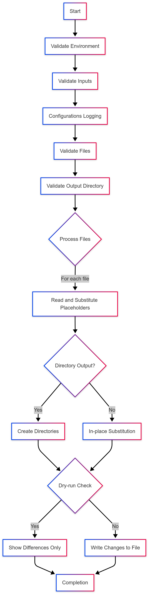

# GitHub Environment Variable Substitutor 🔄

[](https://github.com/uditpatel014/env-var-substitutor-action/actions/workflows/ci_test.yml)
[](https://github.com/uditpatel014/env-var-substitutor-action/actions/workflows/test_action.yml)
[](https://github.com/<your-username>/env-substitutor-action/releases)

## 🚀 **Overview**
This GitHub Action dynamically replaces placeholders in files with environment variables during a workflow run.
It supports custom prefixes, multiple files, dry-run mode, and flexible output locations, making it ideal for configuring deployment files, secrets, or other automation scripts.
A flexible GitHub Action for configuration management using dynamic prefix-based placeholder substitution with environment 
variables with enhanced validation and error handling.

## Features 🌟

✅ **Dynamic Prefix-based placeholder substitution** (e.g., `${env.DB_HOST}`, `${xyz.DB_PASS}`)  
✅ **Custom Prefix Support** – Use any prefix (default: `env`,`xyz`,`abc`)  
✅ **Multiple output modes**: In-place or custom directory  
✅ **Dry-run capability** with colored diffs 🔍  
✅ **Auto directory creation** for complex paths  
✅ **Validation system**:

- 3-character prefix enforcement
- File existence checks
- Write permission verification

✅ **Fail-fast mode** for CI/CD safety  
✅ **Comprehensive test coverage** (100% scenario coverage)

## Table of Contents 📖

- [Usage Examples](#usage-examples-)
- [Working Principle](#working-principle-)
- [Installation](#installation-)
- [Input Parameters](#input-parameters-)
- [Contributing](#contributing-)
- [Contribution Opportunities](#contribution-opportunities)
- [License](#license-)
- [Author](#author-)


---
## 🏆 Use Cases

##### ✔ _**Config File Injection**_ – Inject API keys, secrets, or environment-specific settings.  
##### ✔ _**CI/CD Pipelines**_ – Modify configuration files before deployment.  
##### ✔ _**Templating**_ – Dynamically create environment-specific files.

---
## Usage Examples 🚀

### Basic Usage

```yaml
- uses: your-username/env-substitutor-action@v1
  with:
    files: 'config/*.conf'
    placeholder-prefix: 'env'
  env:
    DB_HOST: postgres-prod
    API_KEY: ${{ secrets.API_KEY }}
```

### Custom Output Directory

```yaml
- uses: your-username/env-substitutor-action@v1
  with:
    files: 'templates/*.yaml'
    destination-path: 'generated-configs'
    placeholder-prefix: 'cfg'
  env:
    ENVIRONMENT: production
```

### Dry Run Mode

```yaml
- uses: your-username/env-substitutor-action@v1
  with:
    files: 'app-config.json'
    dry-run: true
  env:
    APP_VERSION: 2.1.0
```
---
## Installation 📦

1. Add to your workflow:
```yaml
- name: Setup Environment Substitutor
  uses: your-username/env-substitutor-action@v1
```
2. **Required:** Install gettext package in bash environment(if not present by default)
```yaml
- name: Install Dependencies
  run: sudo apt-get update && sudo apt-get install -y gettext
```
--- 
## Input Parameters 📝

| Parameter	          | Required	 | Default    | 	Description                         |
|---------------------|-----------|------------|--------------------------------------|
| files               | 	Yes	     | -          | 	Comma-separated file patterns       |
| placeholder-prefix	 | No	       | env        | 	3-character variable prefix         |
| destination-path	   | No        | 	optional	 | Output directory/file path           |
| dry-run	            | No        | 	false	    | Preview changes without modification |
| fail-fast	          | No        | 	true	     | Stop on first error                  |
| create-directories	 | No        | 	true      | 	Auto-create output directories      |
---
### Working Principle ⚙



[//]: # (alternate)

[//]: # ()

---
## Contribution Opportunities
- 🐛 Bug hunting in edge cases
- 📈 Performance optimization
- 🌍 Multi-language documentation 
- 🧪 Additional test scenarios
---
## Contributing 🤝
_Contributions are always welcomed !_ **Please see:**
- Contribution Guidelines 
- Code of Conduct
- Security Policy
---
## License
MIT License. See [LICENSE](LICENSE).

---

## Author 🗺️
- [Udit Patel](https://www.linkedin.com/in/udit-patel-69b313113/) 🕸️


